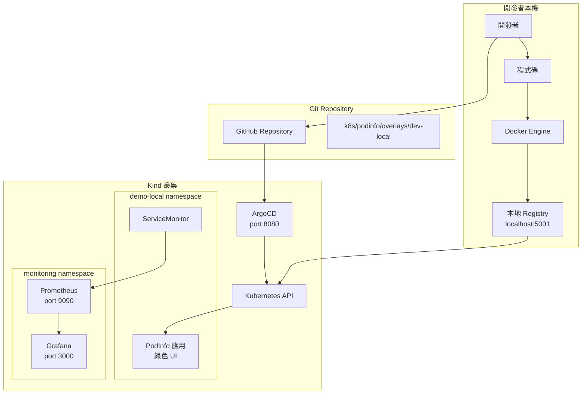
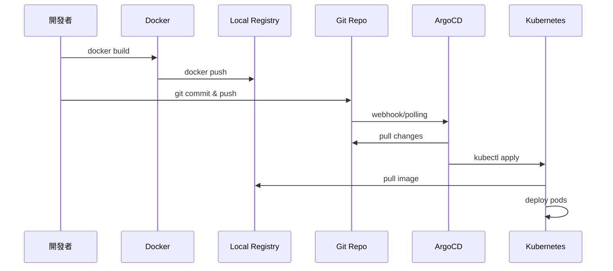

# 本地開發工作流程完整指南 (Local Development Workflow)

## 📋 目錄

1. [概述](#概述)
2. [架構說明](#架構說明)
3. [前置準備](#前置準備)
4. [環境建置流程](#環境建置流程)
5. [本地開發循環](#本地開發循環)
6. [GitOps 同步流程](#gitops-同步流程)
7. [監控與觀測](#監控與觀測)
8. [故障排除](#故障排除)
9. [最佳實踐](#最佳實踐)

---

## 概述

本地開發工作流程專注於快速迭代開發，使用 Kind (Kubernetes in Docker) 叢集配合本地 Docker Registry，實現零延遲的映像推送與部署。

### 核心特色
- ✅ **本地 Registry**: `localhost:5001` 無需外部網路
- ✅ **快速迭代**: 秒級映像推送，無需等待 CI/CD
- ✅ **完整 GitOps**: ArgoCD 自動同步 Git 變更
- ✅ **環境隔離**: `demo-local` 命名空間獨立運作
- ✅ **即時監控**: Prometheus + Grafana 本地監控

---

## 架構說明



### 關鍵組件說明

| 組件 | 用途 | 存取方式 |
|------|------|---------|
| Kind Cluster | 本地 K8s 環境 | `kubectl` |
| Local Registry | 映像儲存庫 | `localhost:5001` |
| ArgoCD | GitOps 控制器 | `http://localhost:8080` |
| Prometheus | 指標收集 | `http://localhost:9090` |
| Grafana | 視覺化儀表板 | `http://localhost:3000` |
| PodInfo | 示範應用 | `http://localhost:9898` |

---

## 前置準備

### 1. 安裝必要工具

```bash
# 檢查所有前置條件
make check-prereqs
```

必要工具清單：
- **Docker Desktop**: 容器執行環境
- **kind**: 本地 K8s 叢集工具
- **kubectl**: K8s CLI 工具
- **yq**: YAML 處理工具
- **git**: 版本控制

### 2. 安裝工具指令

```bash
# macOS (使用 Homebrew)
brew install kind kubectl yq git

# Linux
curl -Lo ./kind https://kind.sigs.k8s.io/dl/v0.24.0/kind-linux-amd64
chmod +x ./kind && sudo mv ./kind /usr/local/bin/

# Windows (使用 Chocolatey)
choco install kind kubectl yq git
```

### 3. 驗證 Docker 運行狀態

```bash
docker info
docker ps
```

---

## 環境建置流程

### Step 1: 建立 Kind 叢集與本地 Registry

```bash
make setup-cluster
```

**執行細節：**
```bash
# 實際執行的腳本
cd clusters/kind/scripts && ./kind-with-registry.sh

# 內部動作：
# 1. 啟動 Registry 容器在 localhost:5001
# 2. 建立 3 節點 Kind 叢集（1 control + 2 workers）
# 3. 配置 containerd 使用本地 registry
# 4. 設定網路連接
```

**驗證叢集狀態：**
```bash
# 檢查節點
kubectl get nodes

# 預期輸出
NAME                        STATUS   ROLES           AGE   VERSION
gitops-demo-control-plane   Ready    control-plane   2m    v1.33.1
gitops-demo-worker          Ready    <none>          2m    v1.33.1
gitops-demo-worker2         Ready    <none>          2m    v1.33.1

# 檢查 Docker 容器
docker ps --format "table {{.Names}}\t{{.Ports}}"

# 重要端口映射
# localhost:5001 -> Registry
# localhost:8080 -> ArgoCD UI
# localhost:3000 -> Grafana
# localhost:9090 -> Prometheus
```

### Step 2: 安裝 ArgoCD

```bash
make install-argocd
```

**執行細節：**
```bash
# 建立命名空間
kubectl create namespace argocd

# 安裝 ArgoCD 組件
kubectl apply -n argocd -f https://raw.githubusercontent.com/argoproj/argo-cd/stable/manifests/install.yaml

# 等待就緒
kubectl wait --for=condition=available --timeout=600s deployment/argocd-server -n argocd

# 取得密碼
kubectl -n argocd get secret argocd-initial-admin-secret -o jsonpath="{.data.password}" | base64 -d
```

**記下 admin 密碼：**
```
🔐 ArgoCD admin password: p9N0uL41MPdJepjc
```

### Step 3: 部署監控系統

```bash
make deploy-monitoring
```

**執行細節：**
```bash
# 部署 kube-prometheus-stack
kubectl apply -f monitoring/kube-prometheus-stack/application.yaml

# 包含組件：
# - Prometheus Server
# - Grafana
# - AlertManager
# - Node Exporters
# - ServiceMonitor CRDs
```

### Step 4: 部署應用到 ArgoCD

```bash
make deploy-apps
```

**執行細節：**
```bash
# 部署 ArgoCD Applications
kubectl apply -f gitops/argocd/apps/

# 建立的應用：
# - podinfo-local: 使用本地 registry
# - podinfo-ghcr: 使用 GitHub registry（會失敗，正常）
```

---

## 本地開發循環

### 完整開發流程

```bash
# 一鍵執行完整流程
make dev-local-release
```

### 分步驟執行

#### 1. 修改程式碼

```bash
# 編輯 Dockerfile 或應用配置
vi Dockerfile

# 簡單 Dockerfile 範例
FROM stefanprodan/podinfo:6.6.0
# Ports: 9898 (http), 9797 (metrics), 9999 (grpc)
```

#### 2. 建置映像

```bash
make dev-local-build

# 實際執行
SHA=$(git rev-parse --short HEAD)
docker build -t localhost:5001/podinfo:dev-${SHA} .
```

#### 3. 推送到本地 Registry

```bash
make dev-local-push

# 實際執行
docker push localhost:5001/podinfo:dev-${SHA}

# 驗證推送
curl -s http://localhost:5001/v2/podinfo/tags/list | jq
```

#### 4. 更新 Kustomize 配置

```bash
make dev-local-update

# 實際執行
yq -i '.images[0].newTag = "dev-${SHA}"' \
  k8s/podinfo/overlays/dev-local/kustomization.yaml
```

#### 5. 提交到 Git

```bash
make dev-local-commit

# 實際執行
git add k8s/podinfo/overlays/dev-local/kustomization.yaml
git commit -m "chore(local): bump image tag to dev-${SHA}"
git push origin main
```

### 開發循環時序圖



---

## GitOps 同步流程

### ArgoCD 自動同步機制

```yaml
# gitops/argocd/apps/podinfo-local.yaml
syncPolicy:
  automated:
    prune: true      # 自動刪除不在 Git 的資源
    selfHeal: true   # 自動修復漂移
```

### 手動觸發同步

```bash
# 如果需要立即同步
kubectl patch application podinfo-local -n argocd \
  --type=json -p='[{"op": "add", "path": "/operation", 
  "value": {"sync": {"prune": true}}}]'
```

### 監控同步狀態

```bash
# 查看應用狀態
kubectl get applications -n argocd

# 詳細狀態
kubectl describe application podinfo-local -n argocd

# ArgoCD UI
make port-forward-argocd
# 開啟 http://localhost:8080
```

---

## 監控與觀測

### 1. 存取監控服務

```bash
# 啟動所有 port-forward
make port-forward-all
```

服務端點：
- **ArgoCD**: http://localhost:8080 (admin/密碼)
- **Grafana**: http://localhost:3000 (admin/admin123!@#)
- **Prometheus**: http://localhost:9090

### 2. ServiceMonitor 配置

```yaml
# k8s/podinfo/base/servicemonitor.yaml
apiVersion: monitoring.coreos.com/v1
kind: ServiceMonitor
metadata:
  name: podinfo
spec:
  selector:
    matchLabels:
      app: podinfo
  endpoints:
  - port: http-metrics
    path: /metrics
    interval: 30s
```

### 3. 驗證指標收集

```bash
# 測試 Prometheus 抓取
curl -s 'http://localhost:9090/api/v1/query?query=up{job="local-podinfo"}' | jq

# 檢查應用指標
curl -s http://localhost:9898/metrics | grep podinfo
```

### 4. Grafana 儀表板

1. 登入 Grafana (admin/admin123!@#)
2. 導入 Dashboard ID: 15760 (Kubernetes Cluster Overview)
3. 建立自訂儀表板監控 podinfo

---

## 故障排除

### 問題 1: 映像拉取失敗

```bash
# 檢查 Registry 狀態
docker ps | grep kind-registry

# 測試 Registry 連線
curl http://localhost:5001/v2/_catalog

# 重啟 Registry
docker restart kind-registry

# 測試推送
make registry-test
```

### 問題 2: Pod 無法啟動

```bash
# 查看 Pod 狀態
kubectl get pods -n demo-local

# 詳細錯誤資訊
kubectl describe pod -n demo-local <pod-name>

# 查看日誌
kubectl logs -n demo-local <pod-name>

# 常見原因：
# - ImagePullBackOff: 映像不存在
# - CrashLoopBackOff: 應用啟動失敗
```

### 問題 3: ArgoCD OutOfSync

```bash
# 檢查差異
kubectl get application podinfo-local -n argocd -o yaml | grep -A10 "status:"

# 手動同步
argocd app sync podinfo-local

# 或使用 kubectl
kubectl patch application podinfo-local -n argocd \
  --type merge -p '{"operation": {"initiatedBy": {"username": "admin"}, "sync": {}}}'
```

### 問題 4: ServiceMonitor 不生效

```bash
# 確認 CRD 存在
kubectl get crd servicemonitors.monitoring.coreos.com

# 檢查 ServiceMonitor
kubectl get servicemonitor -n demo-local

# 驗證標籤匹配
kubectl get svc -n demo-local --show-labels

# 查看 Prometheus 配置
kubectl port-forward -n monitoring svc/kube-prometheus-stack-prometheus 9090:9090
# 訪問 http://localhost:9090/config
```

### 問題 5: 本地 Registry 網路問題

```bash
# 檢查網路連接
docker network inspect kind

# 重新連接 Registry
docker network disconnect kind kind-registry
docker network connect kind kind-registry

# 驗證從叢集內部存取
kubectl run test-registry --image=busybox --rm -it --restart=Never -- \
  wget -qO- http://kind-registry:5000/v2/_catalog
```

---

## 最佳實踐

### 1. 映像標籤策略

```bash
# ✅ 使用 Git commit SHA
dev-${GIT_SHA}

# ✅ 加上時間戳（調試用）
dev-${GIT_SHA}-${TIMESTAMP}

# ❌ 避免使用
latest
dev
```

### 2. Kustomize 組織結構

```
k8s/podinfo/
├── base/                 # 基礎配置
│   ├── deployment.yaml
│   ├── service.yaml
│   └── kustomization.yaml
└── overlays/
    └── dev-local/       # 本地環境覆寫
        ├── namespace.yaml
        └── kustomization.yaml
```

### 3. Git 提交規範

```bash
# 格式: type(scope): description

chore(local): bump image tag to dev-abc123
feat(local): add health check endpoint
fix(local): resolve memory leak issue
```

### 4. 資源限制

```yaml
# 為本地開發設置合理的資源限制
resources:
  limits:
    memory: "256Mi"
    cpu: "200m"
  requests:
    memory: "128Mi"
    cpu: "100m"
```

### 5. 開發流程自動化

```bash
# 建立別名簡化操作
alias kl='kubectl -n demo-local'
alias kdp='kubectl describe pod -n demo-local'
alias klogs='kubectl logs -n demo-local'

# 使用 watch 監控變化
watch kubectl get pods -n demo-local
```

### 6. 清理與重置

```bash
# 清理應用
make clean-apps

# 完整重置環境
make clean

# 快速重新開始
make quickstart
```

---

## 快速參考

### 常用指令速查表

| 動作 | 指令 |
|------|------|
| 完整設置 | `make quickstart` |
| 建置+推送+更新 | `make dev-local-release` |
| 查看狀態 | `make status` |
| 存取服務 | `make port-forward-all` |
| 查看日誌 | `kubectl logs -n demo-local -l app=podinfo` |
| 重啟 Pod | `kubectl rollout restart deploy/local-podinfo -n demo-local` |
| 清理環境 | `make clean` |

### 服務端點

| 服務 | URL | 認證 |
|------|-----|------|
| ArgoCD | http://localhost:8080 | admin/[密碼] |
| Grafana | http://localhost:3000 | admin/admin123!@# |
| Prometheus | http://localhost:9090 | 無 |
| PodInfo | http://localhost:9898 | 無 |

### 偵錯指令

```bash
# Pod 狀態
kubectl get pods -n demo-local -o wide

# 事件記錄
kubectl get events -n demo-local --sort-by='.lastTimestamp'

# 資源使用
kubectl top pods -n demo-local

# ArgoCD 同步狀態
kubectl get app -n argocd podinfo-local -o jsonpath='{.status.sync.status}'

# Registry 內容
curl -s http://localhost:5001/v2/_catalog | jq
```

---

## 總結

本地開發工作流程提供了完整的 GitOps 開發體驗，透過本地 Registry 實現快速迭代，配合 ArgoCD 自動同步確保環境一致性。這套流程特別適合：

- 🚀 快速原型開發
- 🧪 功能測試與驗證
- 🔧 除錯與故障排除
- 📚 學習 Kubernetes 與 GitOps

關鍵優勢：
- **零延遲**：本地 Registry 秒級推送
- **完整性**：包含監控與可觀測性
- **隔離性**：不影響其他環境
- **可重現**：一鍵重建整個環境