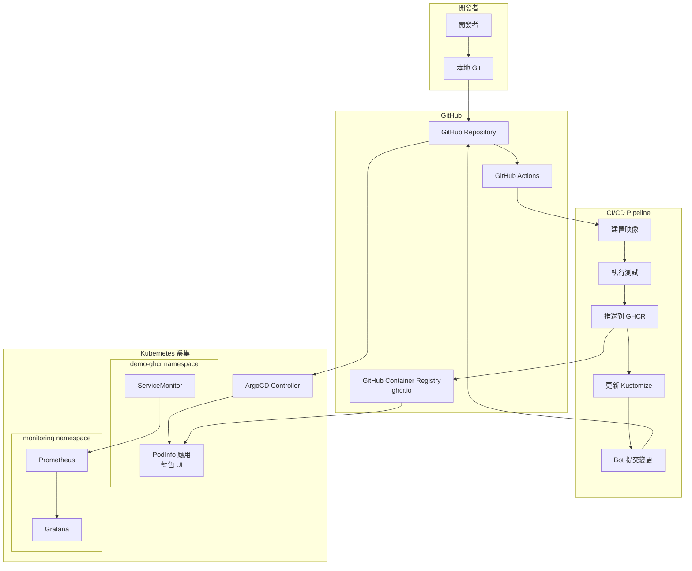
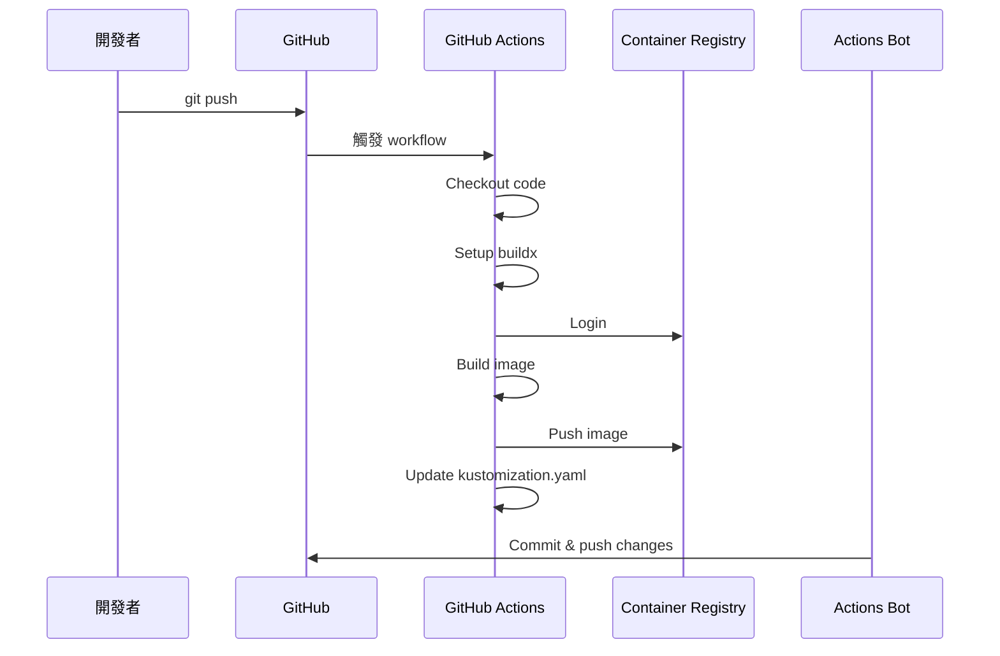

# GHCR CI/CD 工作流程完整指南 (GitHub Container Registry Workflow)

## 📋 目錄

1. [概述](#概述)
2. [架構說明](#架構說明)
3. [前置準備](#前置準備)
4. [GitHub Actions 設置](#github-actions-設置)
5. [自動化 CI/CD 流程](#自動化-cicd-流程)
6. [GitOps 自動同步](#gitops-自動同步)
7. [監控與追蹤](#監控與追蹤)
8. [進階配置](#進階配置)
9. [故障排除](#故障排除)
10. [最佳實踐](#最佳實踐)

---

## 概述

GHCR 工作流程實現完全自動化的 CI/CD pipeline，當程式碼推送到 GitHub 時，自動建置、測試、推送映像到 GitHub Container Registry，並更新 Kubernetes 配置觸發 ArgoCD 部署。

### 核心特色
- ✅ **全自動化**: Git push 觸發完整 CI/CD
- ✅ **多平台建置**: 支援 linux/amd64 和 linux/arm64
- ✅ **版本追蹤**: 使用 Git SHA 作為不可變標籤
- ✅ **自動更新**: GitHub Actions Bot 更新 Kustomize 配置
- ✅ **零停機部署**: ArgoCD 滾動更新策略

---

## 架構說明



### 關鍵差異對比

| 特性 | 本地工作流程 | GHCR 工作流程 |
|------|-------------|--------------|
| 觸發方式 | 手動執行 make | Git push 自動觸發 |
| 映像儲存 | localhost:5001 | ghcr.io |
| 建置環境 | 本機 Docker | GitHub Actions Runner |
| 更新方式 | 開發者手動提交 | Bot 自動提交 |
| 部署速度 | 秒級（本地） | 分鐘級（CI/CD） |
| 適用場景 | 開發測試 | 正式發布 |

---

## 前置準備

### 1. GitHub Repository 設置

```bash
# Fork 或 Clone repository
git clone https://github.com/liu-chun-wu/k8s-Gitops-Prometheus-Grafana.git
cd k8s-Gitops-Prometheus-Grafana

# 設置 upstream (如果是 fork)
git remote add upstream https://github.com/liu-chun-wu/k8s-Gitops-Prometheus-Grafana.git
```

### 2. 確認 GitHub Actions 啟用

1. 進入 GitHub Repository Settings
2. 點選 Actions → General
3. 確認 "Actions permissions" 設為 "Allow all actions"

### 3. 設置 Repository Permissions

```yaml
# .github/workflows/release-ghcr.yml 需要的權限
permissions:
  contents: write    # 提交變更到 repository
  packages: write    # 推送映像到 GHCR
```

### 4. GHCR 認證設置（自動處理）

GitHub Actions 使用 `GITHUB_TOKEN` 自動認證，無需額外設置。

---

## GitHub Actions 設置

### Workflow 檔案結構

```yaml
# .github/workflows/release-ghcr.yml
name: Build and Push to GHCR

on:
  push:
    branches: ["main"]
  pull_request:
    branches: ["main"]

env:
  REGISTRY: ghcr.io
  IMAGE_NAME: ${{ github.repository }}/podinfo
```

### 完整 CI/CD Pipeline

```yaml
jobs:
  build-and-push:
    runs-on: ubuntu-latest
    permissions:
      contents: write
      packages: write
    
    steps:
      # Step 1: 檢出程式碼
      - name: Checkout repository
        uses: actions/checkout@v4
        with:
          token: ${{ secrets.GITHUB_TOKEN }}
      
      # Step 2: 設置 Docker Buildx (多平台建置)
      - name: Set up Docker Buildx
        uses: docker/setup-buildx-action@v3
      
      # Step 3: 登入 GHCR
      - name: Log in to Container Registry
        uses: docker/login-action@v3
        with:
          registry: ghcr.io
          username: ${{ github.actor }}
          password: ${{ secrets.GITHUB_TOKEN }}
      
      # Step 4: 產生 metadata
      - name: Extract metadata
        id: meta
        uses: docker/metadata-action@v5
        with:
          images: ghcr.io/${{ github.repository }}/podinfo
          tags: |
            type=ref,event=branch
            type=ref,event=pr
            type=sha,prefix={{branch}}-
            type=raw,value={{sha}}
      
      # Step 5: 建置並推送映像
      - name: Build and push Docker image
        uses: docker/build-push-action@v6
        with:
          context: .
          push: true
          tags: ${{ steps.meta.outputs.tags }}
          platforms: linux/amd64,linux/arm64
      
      # Step 6: 更新 Kustomize 配置
      - name: Update Kustomize image tag
        if: github.ref == 'refs/heads/main'
        run: |
          yq -i '.images[0].newTag = "${{ github.sha }}"' \
            k8s/podinfo/overlays/dev-ghcr/kustomization.yaml
          
          git config user.name "github-actions[bot]"
          git config user.email "github-actions[bot]@users.noreply.github.com"
          git add k8s/podinfo/overlays/dev-ghcr/kustomization.yaml
          git commit -m "chore(ghcr): bump image tag to ${{ github.sha }}"
          git push
```

---

## 自動化 CI/CD 流程

### 觸發條件

1. **Push to main branch**
   ```bash
   git add .
   git commit -m "feat: add new feature"
   git push origin main
   ```

2. **Pull Request**
   ```bash
   git checkout -b feature/new-feature
   git push origin feature/new-feature
   # 建立 PR 到 main branch
   ```

### 執行流程詳解

#### Phase 1: 程式碼變更
```bash
# 開發者修改程式碼
vi src/app.js

# 提交變更
git add .
git commit -m "feat: implement health check endpoint"
git push origin main
```

#### Phase 2: GitHub Actions 觸發


#### Phase 3: 映像標籤策略

產生的映像標籤範例：
```bash
# 完整 SHA
ghcr.io/liu-chun-wu/k8s-gitops-prometheus-grafana/podinfo:5410f1e010ecbc4b5a17eb6c6979b3b6b63e099f

# 分支-SHA
ghcr.io/liu-chun-wu/k8s-gitops-prometheus-grafana/podinfo:main-5410f1e

# 分支名稱
ghcr.io/liu-chun-wu/k8s-gitops-prometheus-grafana/podinfo:main
```

#### Phase 4: Kustomize 自動更新

```yaml
# k8s/podinfo/overlays/dev-ghcr/kustomization.yaml
# 自動更新前
images:
  - name: ghcr.io/stefanprodan/podinfo
    newName: ghcr.io/liu-chun-wu/k8s-gitops-prometheus-grafana/podinfo
    newTag: old-sha

# 自動更新後
images:
  - name: ghcr.io/stefanprodan/podinfo
    newName: ghcr.io/liu-chun-wu/k8s-gitops-prometheus-grafana/podinfo
    newTag: 5410f1e010ecbc4b5a17eb6c6979b3b6b63e099f
```

---

## GitOps 自動同步

### ArgoCD Application 配置

```yaml
# gitops/argocd/apps/podinfo-ghcr.yaml
apiVersion: argoproj.io/v1alpha1
kind: Application
metadata:
  name: podinfo-ghcr
  namespace: argocd
spec:
  source:
    repoURL: https://github.com/liu-chun-wu/k8s-Gitops-Prometheus-Grafana.git
    path: k8s/podinfo/overlays/dev-ghcr
    targetRevision: main
  destination:
    server: https://kubernetes.default.svc
    namespace: demo-ghcr
  syncPolicy:
    automated:
      prune: true
      selfHeal: true
    syncOptions:
      - CreateNamespace=true
```

### 同步流程

1. **GitHub Actions Bot 提交變更**
   ```
   commit: chore(ghcr): bump image tag to 5410f1e010ecbc4b5a17eb6c6979b3b6b63e099f
   ```

2. **ArgoCD 偵測變更** (預設 3 分鐘輪詢)
   ```bash
   # 查看同步狀態
   kubectl get application podinfo-ghcr -n argocd
   ```

3. **自動部署新版本**
   ```bash
   # 監控部署進度
   kubectl rollout status deployment/ghcr-podinfo -n demo-ghcr
   ```

### 驗證部署

```bash
# 檢查運行的映像版本
kubectl get pods -n demo-ghcr -o jsonpath='{.items[*].spec.containers[*].image}'

# 應該顯示最新的 GHCR 映像
ghcr.io/liu-chun-wu/k8s-gitops-prometheus-grafana/podinfo:5410f1e010ecbc4b5a17eb6c6979b3b6b63e099f
```

---

## 監控與追蹤

### 1. GitHub Actions 監控

#### 查看 Workflow 執行狀態
1. 進入 GitHub Repository
2. 點選 Actions 標籤
3. 查看 "Build and Push to GHCR" workflow

#### Workflow 執行詳情
```bash
# 使用 GitHub CLI
gh run list --workflow=release-ghcr.yml
gh run view <run-id>
```

### 2. GHCR 映像管理

#### 查看映像清單
1. 進入 GitHub Repository
2. 右側 Packages 區塊
3. 點選 podinfo package

#### 使用 CLI 查看
```bash
# 需要先登入
echo $GITHUB_TOKEN | docker login ghcr.io -u USERNAME --password-stdin

# 拉取映像
docker pull ghcr.io/liu-chun-wu/k8s-gitops-prometheus-grafana/podinfo:latest

# 查看映像資訊
docker inspect ghcr.io/liu-chun-wu/k8s-gitops-prometheus-grafana/podinfo:latest
```

### 3. ArgoCD 同步監控

```bash
# Port forward ArgoCD
kubectl port-forward svc/argocd-server -n argocd 8080:443

# 查看應用同步狀態
kubectl get application podinfo-ghcr -n argocd -o yaml | grep -A10 "status:"

# 查看同步歷史
kubectl logs -n argocd deployment/argocd-application-controller | grep podinfo-ghcr
```

### 4. Prometheus 指標

```bash
# 查詢部署相關指標
curl -s 'http://localhost:9090/api/v1/query?query=kube_deployment_status_replicas{deployment="ghcr-podinfo"}' | jq

# 應用自訂指標
curl -s 'http://localhost:9090/api/v1/query?query=http_requests_total{job="ghcr-podinfo"}' | jq
```

### 5. Grafana 儀表板

建立自訂儀表板監控 GHCR 部署：

```json
{
  "dashboard": {
    "title": "GHCR Deployment Monitor",
    "panels": [
      {
        "title": "Deployment Status",
        "targets": [
          {
            "expr": "kube_deployment_status_replicas{namespace=\"demo-ghcr\"}"
          }
        ]
      },
      {
        "title": "Image Pull Rate",
        "targets": [
          {
            "expr": "rate(kube_pod_container_status_restarts_total{namespace=\"demo-ghcr\"}[5m])"
          }
        ]
      }
    ]
  }
}
```

---

## 進階配置

### 1. 分支策略

```yaml
# 為不同分支使用不同 overlay
on:
  push:
    branches:
      - main        # 部署到 dev-ghcr
      - staging     # 部署到 staging-ghcr
      - production  # 部署到 prod-ghcr

# 動態選擇 overlay
- name: Determine overlay
  id: overlay
  run: |
    if [[ "${{ github.ref }}" == "refs/heads/main" ]]; then
      echo "overlay=dev-ghcr" >> $GITHUB_OUTPUT
    elif [[ "${{ github.ref }}" == "refs/heads/staging" ]]; then
      echo "overlay=staging-ghcr" >> $GITHUB_OUTPUT
    elif [[ "${{ github.ref }}" == "refs/heads/production" ]]; then
      echo "overlay=prod-ghcr" >> $GITHUB_OUTPUT
    fi

- name: Update Kustomize
  run: |
    yq -i '.images[0].newTag = "${{ github.sha }}"' \
      k8s/podinfo/overlays/${{ steps.overlay.outputs.overlay }}/kustomization.yaml
```

### 2. 測試整合

```yaml
# 加入測試步驟
- name: Run tests
  run: |
    # 單元測試
    make test
    
    # 整合測試
    make test-integration
    
    # 安全掃描
    trivy image ghcr.io/${{ github.repository }}/podinfo:${{ github.sha }}

# 只在測試通過後部署
- name: Deploy only if tests pass
  if: success()
  run: |
    # 更新 Kustomize
```

### 3. 通知整合

```yaml
# Slack 通知
- name: Slack Notification
  if: always()
  uses: 8398a7/action-slack@v3
  with:
    status: ${{ job.status }}
    text: |
      Deployment: ${{ job.status }}
      Commit: ${{ github.sha }}
      Author: ${{ github.actor }}
    webhook_url: ${{ secrets.SLACK_WEBHOOK }}

# Email 通知
- name: Send email
  if: failure()
  uses: dawidd6/action-send-mail@v3
  with:
    server_address: smtp.gmail.com
    server_port: 465
    username: ${{ secrets.EMAIL_USERNAME }}
    password: ${{ secrets.EMAIL_PASSWORD }}
    subject: Build Failed - ${{ github.repository }}
    to: devops@example.com
```

### 4. 多環境部署

```yaml
# 使用 Matrix 策略
strategy:
  matrix:
    environment: [dev, staging, prod]
    include:
      - environment: dev
        overlay: dev-ghcr
        auto_deploy: true
      - environment: staging
        overlay: staging-ghcr
        auto_deploy: true
      - environment: prod
        overlay: prod-ghcr
        auto_deploy: false  # 需要手動批准

steps:
  - name: Deploy to ${{ matrix.environment }}
    if: matrix.auto_deploy || github.event_name == 'workflow_dispatch'
    run: |
      yq -i '.images[0].newTag = "${{ github.sha }}"' \
        k8s/podinfo/overlays/${{ matrix.overlay }}/kustomization.yaml
```

### 5. 快取優化

```yaml
# Docker 層快取
- name: Set up Docker Buildx
  uses: docker/setup-buildx-action@v3
  with:
    driver-opts: |
      image=moby/buildkit:latest
      network=host

- name: Build and push
  uses: docker/build-push-action@v6
  with:
    cache-from: type=gha
    cache-to: type=gha,mode=max
    platforms: linux/amd64,linux/arm64
```

---

## 故障排除

### 問題 1: GitHub Actions 權限錯誤

```yaml
# 錯誤訊息
Error: Resource not accessible by integration

# 解決方案
# 確認 workflow 有正確權限
permissions:
  contents: write
  packages: write
  
# 或在 Repository Settings → Actions → General
# 設置 "Workflow permissions" 為 "Read and write permissions"
```

### 問題 2: GHCR 推送失敗

```bash
# 錯誤訊息
denied: installation not allowed to Create organization package

# 解決方案
# 1. 確認 package 命名正確
IMAGE_NAME: ${{ github.repository }}/podinfo

# 2. 確認組織設定允許 GitHub Actions 建立 packages
# Organization Settings → Packages → Package creation
```

### 問題 3: Kustomize 更新衝突

```bash
# 錯誤訊息
! [rejected] main -> main (fetch first)

# 解決方案
- name: Update Kustomize
  run: |
    # 先拉取最新變更
    git pull --rebase origin main
    
    # 更新 kustomization.yaml
    yq -i '.images[0].newTag = "${{ github.sha }}"' \
      k8s/podinfo/overlays/dev-ghcr/kustomization.yaml
    
    # 重試推送
    git push origin main || (git pull --rebase && git push)
```

### 問題 4: ArgoCD 無法拉取 GHCR 映像

```bash
# 建立 image pull secret
kubectl create secret docker-registry ghcr-secret \
  --docker-server=ghcr.io \
  --docker-username=<github-username> \
  --docker-password=<github-token> \
  --docker-email=<email> \
  -n demo-ghcr

# 更新 deployment 使用 secret
kubectl patch serviceaccount default -n demo-ghcr \
  -p '{"imagePullSecrets": [{"name": "ghcr-secret"}]}'
```

### 問題 5: 多平台建置失敗

```yaml
# 錯誤訊息
error: multiple platforms feature is currently not supported for docker driver

# 解決方案
# 使用 buildx with docker-container driver
- name: Set up Docker Buildx
  uses: docker/setup-buildx-action@v3
  with:
    driver: docker-container
    driver-opts: network=host
```

---

## 最佳實踐

### 1. 安全性最佳實踐

```yaml
# 使用 Dependabot 更新依賴
# .github/dependabot.yml
version: 2
updates:
  - package-ecosystem: "docker"
    directory: "/"
    schedule:
      interval: "weekly"
  
  - package-ecosystem: "github-actions"
    directory: "/"
    schedule:
      interval: "weekly"

# 掃描映像漏洞
- name: Run Trivy vulnerability scanner
  uses: aquasecurity/trivy-action@master
  with:
    image-ref: ghcr.io/${{ github.repository }}/podinfo:${{ github.sha }}
    format: 'sarif'
    output: 'trivy-results.sarif'

- name: Upload Trivy results
  uses: github/codeql-action/upload-sarif@v2
  with:
    sarif_file: 'trivy-results.sarif'
```

### 2. 效能優化

```yaml
# 並行建置多架構
- name: Build and push
  uses: docker/build-push-action@v6
  with:
    platforms: linux/amd64,linux/arm64
    cache-from: |
      type=registry,ref=ghcr.io/${{ github.repository }}/podinfo:buildcache
    cache-to: |
      type=registry,ref=ghcr.io/${{ github.repository }}/podinfo:buildcache,mode=max
```

### 3. 版本管理

```bash
# 語意化版本標籤
tags: |
  type=semver,pattern={{version}}
  type=semver,pattern={{major}}.{{minor}}
  type=sha,prefix={{branch}}-
  type=ref,event=pr,prefix=pr-
```

### 4. 回滾策略

```bash
# ArgoCD 回滾到前一版本
argocd app rollback podinfo-ghcr --revision 1

# 或使用 kubectl
kubectl rollout undo deployment/ghcr-podinfo -n demo-ghcr

# 查看回滾歷史
kubectl rollout history deployment/ghcr-podinfo -n demo-ghcr
```

### 5. 成本優化

```yaml
# 定期清理舊映像
- name: Delete old packages
  uses: actions/delete-package-versions@v4
  with:
    package-name: 'podinfo'
    package-type: 'container'
    min-versions-to-keep: 10
    delete-only-pre-release-versions: false
```

---

## 監控指標與 KPI

### 關鍵效能指標

| 指標 | 目標值 | 測量方式 |
|------|--------|----------|
| 建置時間 | < 5 分鐘 | GitHub Actions duration |
| 部署時間 | < 2 分鐘 | ArgoCD sync time |
| 映像大小 | < 100 MB | `docker images` |
| 漏洞數量 | 0 critical | Trivy scan |
| 可用性 | > 99.9% | Prometheus uptime |

### Prometheus 查詢範例

```promql
# 部署頻率
rate(argocd_app_sync_total{name="podinfo-ghcr"}[1h])

# 平均同步時間
avg(argocd_app_sync_duration_seconds{name="podinfo-ghcr"})

# 失敗率
rate(argocd_app_sync_total{name="podinfo-ghcr",phase="Failed"}[1h])

# Pod 重啟次數
rate(kube_pod_container_status_restarts_total{namespace="demo-ghcr"}[1h])
```

---

## 整合測試範例

### 端對端測試

```bash
#!/bin/bash
# e2e-test.sh

# 等待部署完成
kubectl wait --for=condition=available --timeout=300s \
  deployment/ghcr-podinfo -n demo-ghcr

# 取得 Pod IP
POD_IP=$(kubectl get pod -n demo-ghcr -l app=podinfo \
  -o jsonpath='{.items[0].status.podIP}')

# 測試健康檢查
kubectl run test --rm -i --restart=Never --image=busybox -- \
  wget -qO- http://$POD_IP:9898/healthz

# 測試 metrics endpoint
kubectl run test --rm -i --restart=Never --image=busybox -- \
  wget -qO- http://$POD_IP:9898/metrics | grep http_requests_total

# 驗證版本
VERSION=$(kubectl run test --rm -i --restart=Never --image=busybox -- \
  wget -qO- http://$POD_IP:9898/version | jq -r .version)

echo "Deployed version: $VERSION"
```

---

## 總結

GHCR CI/CD 工作流程提供了企業級的自動化部署解決方案，具有以下優勢：

### 主要優勢
- 🚀 **完全自動化**: 從程式碼提交到生產部署
- 🔒 **安全性**: 映像掃描、秘密管理、RBAC
- 📊 **可觀測性**: 完整的監控與日誌
- 🔄 **可靠性**: 自動回滾、健康檢查
- 🌍 **可擴展性**: 多環境、多區域支援

### 適用場景
- 生產環境部署
- 多團隊協作
- 合規性要求高的環境
- 需要審計追蹤的場景

### 快速參考

| 動作 | 說明 |
|------|------|
| 觸發 CI/CD | `git push origin main` |
| 查看建置狀態 | GitHub Actions 頁面 |
| 查看映像 | GitHub Packages 頁面 |
| 監控部署 | ArgoCD UI / `kubectl get app -n argocd` |
| 回滾版本 | `argocd app rollback podinfo-ghcr` |

這套工作流程實現了真正的 GitOps，將 Git 作為唯一的真相來源，確保環境的一致性與可追溯性。