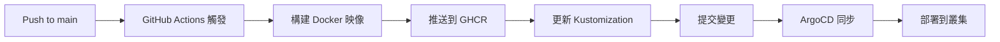

# GHCR CI/CD 流程

本指南詳細說明 GitHub Actions 自動化 CI/CD 流程。

## 工作流程概覽



## GitHub Actions 工作流程

### 觸發條件

```yaml
on:
  push:
    branches: ["main"]
  pull_request:
    branches: ["main"]
```

- **Push to main**: 自動構建並部署
- **Pull Request**: 只構建，不更新 kustomization

### 完整流程步驟

#### 1. Checkout 代碼

```yaml
- name: Checkout repository
  uses: actions/checkout@v4
  with:
    token: ${{ secrets.GITHUB_TOKEN }}
```

#### 2. 設置 Docker Buildx

```yaml
- name: Set up Docker Buildx
  uses: docker/setup-buildx-action@v3
```

支援多平台構建：
- linux/amd64
- linux/arm64

#### 3. 登入 GHCR

```yaml
- name: Log in to Container Registry
  uses: docker/login-action@v3
  with:
    registry: ghcr.io
    username: ${{ github.actor }}
    password: ${{ secrets.GITHUB_TOKEN }}
```

#### 4. 構建並推送映像

```yaml
- name: Build and push Docker image
  uses: docker/build-push-action@v6
  with:
    context: .
    file: ./Dockerfile
    push: true
    tags: ${{ steps.meta.outputs.tags }}
    platforms: linux/amd64,linux/arm64
```

### 映像標籤策略

```yaml
- name: Extract metadata
  uses: docker/metadata-action@v5
  with:
    images: ghcr.io/${{ github.repository }}/podinfo
    tags: |
      type=ref,event=branch
      type=ref,event=pr
      type=sha,prefix={{branch}}-
      type=raw,value={{sha}}
```

產生的標籤：
- `main` - 最新的 main 分支版本
- `main-abc123` - 特定 commit
- `pr-42` - Pull Request 版本

### 5. 更新 Kustomization（僅 main 分支）

```yaml
- name: Update Kustomize image tag
  if: github.event_name == 'push' && github.ref == 'refs/heads/main'
  run: |
    yq -i ".images[0].newTag = \"main-$(echo ${{ github.sha }} | cut -c1-7)\"" \
      k8s/podinfo/overlays/dev-ghcr/kustomization.yaml
    
    git config user.name "github-actions[bot]"
    git config user.email "github-actions[bot]@users.noreply.github.com"
    
    git add k8s/podinfo/overlays/dev-ghcr/kustomization.yaml
    git commit -m "chore(ghcr): bump image tag to ${{ github.sha }}"
    git push
```

## ArgoCD 整合

### 自動同步配置

ArgoCD 會監控 Git 倉庫並自動同步：

```yaml
# gitops/argocd/apps/podinfo-ghcr.yaml
spec:
  syncPolicy:
    automated:
      prune: true
      selfHeal: true
    syncOptions:
      - CreateNamespace=true
```

### 同步間隔

預設 3 分鐘檢查一次，可調整：

```yaml
apiVersion: v1
kind: ConfigMap
metadata:
  name: argocd-cm
  namespace: argocd
data:
  timeout.reconciliation: "60s"  # 改為 60 秒
```

## 分支策略

### 主要分支

- **main**: 生產環境，自動部署
- **develop**: 開發環境（可選）
- **feature/***: 功能分支，只構建不部署

### Pull Request 流程

1. 創建 feature 分支
2. 提交 Pull Request
3. Actions 自動構建並測試
4. Code Review
5. 合併到 main
6. 自動部署

## 監控 CI/CD

### GitHub Actions 狀態

查看 Actions 執行狀態：
- 訪問倉庫的 Actions 標籤
- 查看每個 workflow run 的詳細日誌

### ArgoCD 同步狀態

```bash
# 查看應用狀態
kubectl get application podinfo-ghcr -n argocd

# 查看同步歷史
kubectl describe application podinfo-ghcr -n argocd
```

### 映像版本追蹤

```bash
# 查看當前部署的映像
kubectl get deploy ghcr-podinfo -n demo-ghcr -o jsonpath='{.spec.template.spec.containers[0].image}'

# 查看所有可用標籤
gh api repos/YOUR_REPO/packages/container/podinfo/versions
```

## 回滾策略

### 通過 Git 回滾

```bash
# 回滾 kustomization.yaml
git revert <commit-hash>
git push

# ArgoCD 會自動同步到之前的版本
```

### 通過 ArgoCD 回滾

```bash
# 查看歷史版本
kubectl get application podinfo-ghcr -n argocd -o json | jq '.status.history'

# 回滾到特定版本
argocd app rollback podinfo-ghcr <revision>
```

### 緊急回滾

```bash
# 直接更新 deployment
kubectl set image deployment/ghcr-podinfo \
  podinfo=ghcr.io/YOUR_REPO/podinfo:previous-tag \
  -n demo-ghcr
```

## 優化建議

### 1. 構建快取

使用 Docker layer 快取：
```yaml
- name: Build and push
  uses: docker/build-push-action@v6
  with:
    cache-from: type=gha
    cache-to: type=gha,mode=max
```

### 2. 並行構建

多平台並行構建：
```yaml
strategy:
  matrix:
    platform: [linux/amd64, linux/arm64]
```

### 3. 條件部署

根據標籤或分支條件部署：
```yaml
if: startsWith(github.ref, 'refs/tags/v')
```

## 安全最佳實踐

### 1. 使用 GITHUB_TOKEN

避免使用 Personal Access Token：
```yaml
password: ${{ secrets.GITHUB_TOKEN }}
```

### 2. 限制權限

最小權限原則：
```yaml
permissions:
  contents: read
  packages: write
```

### 3. 掃描漏洞

添加安全掃描步驟：
```yaml
- name: Run Trivy vulnerability scanner
  uses: aquasecurity/trivy-action@master
  with:
    image-ref: ghcr.io/${{ github.repository }}/podinfo:${{ github.sha }}
```

## 故障處理

### Actions 失敗

1. 檢查 Actions 日誌
2. 確認 secrets 配置正確
3. 驗證 Dockerfile 語法

### 映像推送失敗

確認：
- Repository 名稱小寫
- 有 packages:write 權限
- Registry URL 正確

## 下一步

- [故障排除](troubleshooting.md) - 解決 CI/CD 問題
- [監控設置](../../operations/monitoring.md) - 監控部署狀態

## 相關文檔

- [本地開發流程](../local/development.md) - 本地開發工作流程
- [GitHub Actions 文檔](https://docs.github.com/en/actions)